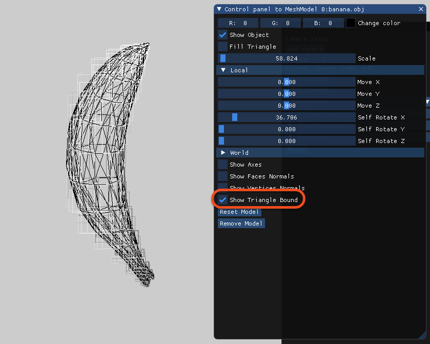
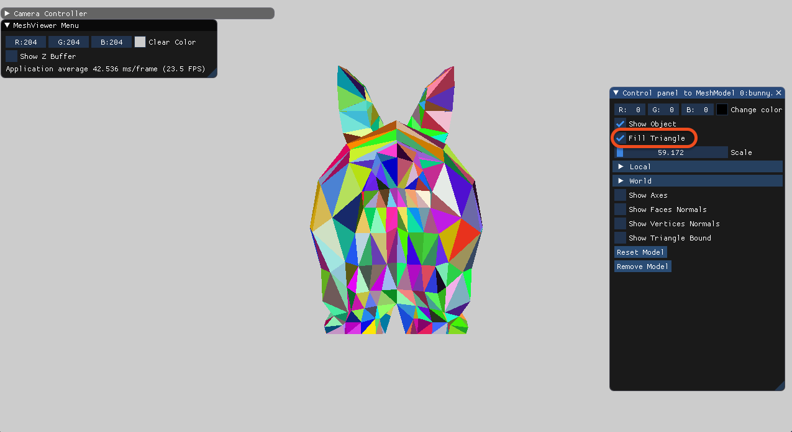
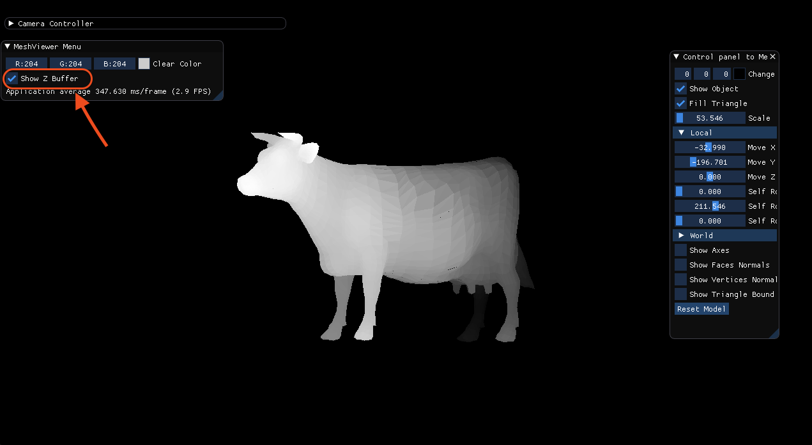
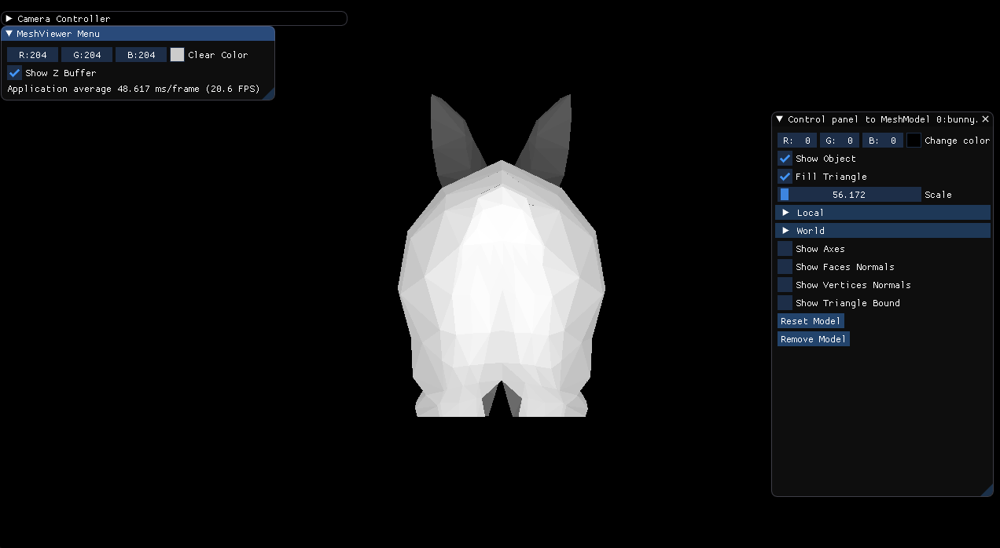

## 1. Draw the bounding rectangle
For drawing the bounding rectangle we need to enable that option.
We calculate the color of the ractangle related to depth, that black is close to the screen and white fare,
we in every traingle we calculate the avarage of the z cordinate and check how far it from the min z cordinate.

## 2. Pass

## 3. Fill the traingle with random color
For fill the traingles with color we enable the 'Fill Traingle' options.

## 3. Z - buffer
First we see the z buffer algoritem on one model:

It is possible to recognize that the back of the wild is darker than the front as we expected to see.

# Bunny model

# Camera

